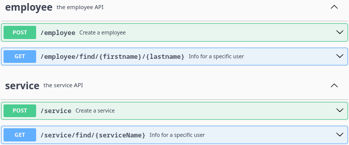
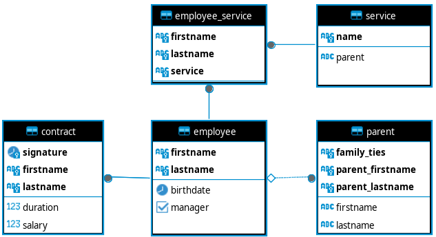
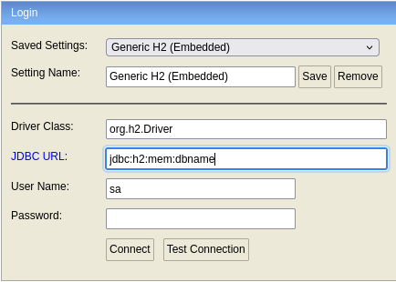
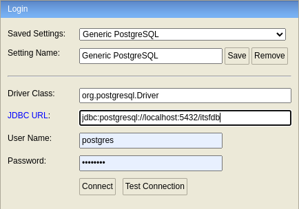

# [ITSF/RISF](https://github.com/gizaoui/itsf)

<br>

## 1. Tests

### 1.1. Exercice 1 - DB

#### 1.1.1 Faire un schema de base de données

- Dans une entreprise on a des salariés qui ont chacun un nom - prenom - **date de naissance**.
- Chaque salarié dispose d'un ou plusieurs **contrats** qui contiennent la date de signature - la duree - le salaire.
- Chaque salarié a des **membres de la famille** qui ont eux aussi un nom - prenom - **ddn**.
- L'entreprise possedes plusieurs service, qui sont **diriger par un employee** et qui en contiennent plusieurs autres (services).
- Chaque employee peut avoir plusieurs **services**


#### 1.1.2 Solution

#### 1.1.2.1 Analyse

Le descriptif du modèle de données laisse apparaître quatre entités distinctes regroupées dans deux entités principales.

Le descriptif du modèle de données peut être interprété de la façon suivante:

- **Employés**
    - Un employé peut posséder un **lien de parentalité** avec d'autres employés.
    - Chaque employé peut posséder un ou plusieurs **contrats**.
    - Un employé **manager** dirige **au moins un service**.
    - Un employé **non manager** peut-être affecté à **plusieurs services**.

- **Services**
    - Un **service** peut-être composé de sous-services.

On en déduit que l'entité **employé** possède des relations de composition avec les entités de **parentalité** et **contrat**.<br>
Les entités **employé** et **service** doivent pouvoir exister séparément même en l'absence d'employé manager.  
 


<br>

#### 1.1.2.2 Modèle de données

Le modèle de données, produit par du *build*, est le suivant:



Les clés primaires sont indiquées en caratères gras.

<br>

Les commandes de création des tables ont été récupérées des traces lors de la création du modèle de données selon la configuration de connexion (cf. application.yaml).<br>

Ex. la connexion à la base de données **PosgreSQL** renvoie les traces suivantes:

```sql
create table contract (signature date not null, duration integer, salary numeric(38,2), firstname varchar(255) not null, lastname varchar(255) not null, primary key (firstname, lastname, signature))
create table employee (firstname varchar(255) not null, lastname varchar(255) not null, birthdate date, manager boolean, primary key (firstname, lastname))
create table employee_service (firstname varchar(255) not null, lastname varchar(255) not null, service varchar(255) not null, primary key (firstname, lastname, service))
create table parent (family_ties varchar(255) not null, parent_firstname varchar(255) not null, parent_lastname varchar(255) not null, firstname varchar(255), lastname varchar(255), primary key (family_ties, parent_firstname, parent_lastname))
create table service (name varchar(255) not null, parent varchar(255), primary key (name))
alter table if exists contract add constraint FKm9ibsivt3gmljblmndg7yo4rq foreign key (firstname, lastname) references employee on delete cascade
alter table if exists employee_service add constraint FKfys3xobq5pgqbsslemnnr87sx foreign key (service) references service
alter table if exists employee_service add constraint FKinu066oqs3llrk79qm9oeb7lt foreign key (firstname, lastname) references employee
alter table if exists parent add constraint FK7s1qy60k0ymom85ifpi08nr5b foreign key (firstname, lastname) references employee on delete cascade
```


### 1.2. Exercice 2 - Code / Scripting

#### 1.2.1. Création d'un test *Junit*

- Faire une boucle de 1 a 100
- quand on rencontre un multiple de 3 imprimer "Chausettes"
- quand on rencontre un multiple de 5 imprimer "Sales"
- quand on recontre un multiple de 3 et de 5 imprimer "ChausettesSales"
- sinon imprimer le nombre

#### 1.2.2. Solution

Exécuter de la commande `mvn clean package` pour visualiser le résultat.

```java
   @Test
   void ChausetteTest() throws Exception {
      logger.info("___________  Test chausette  ___________");

      enum Clothes {
         SOCKS("Chausettes"), DIRTY("Sales"), SOCKSDIRTY("ChausettesSales");

         private String clothe;

         private Clothes(String pathology) {
            this.clothe = pathology;
         }

         public String getValue() {
            return this.clothe;
         }
      }

      for (int loop = 1; loop < 101; ++loop) {
         if (loop % 3 == 0 && loop % 5 == 0) {
            // multiple de 3 et de 5 imprimer "ChausettesSales"
            logger.info(Clothes.SOCKSDIRTY.getValue());
         } else if (loop % 3 == 0) {
            // multiple de 3 imprimer "Chausettes"
            logger.info(Clothes.SOCKS.getValue());
         } else if (loop % 5 == 0) {
            // multiple de 5 imprimer "Sales"
            logger.info(Clothes.DIRTY.getValue());
         } else {
            // sinon imprimer le nombre
            logger.info("" + loop);
         }
      }
   }
```

<br>

---

<br>

## 2. Exécution

### 2.1. Local

#### 2.1.1. Direct

- Implémentation du fichier *openapi* &nbsp;&#8640;&nbsp; `mvn clean generate-sources`
- Build & exécution des tests *Junit* &nbsp;&#8640;&nbsp; `mvn clean package`
- Lancement du serveur &nbsp;&#8640;&nbsp; `mvn clean compile spring-boot:run`
- Interface [swagger-ui](http://localhost:9090/swagger-ui/index.html).
- Base de données [h2-console](http://localhost:9090/h2-console)

#### 2.1.2. Dockerfile
- Mettre à jour le nom de l'archive (*itsf.war*) dans le fichiers [*Dockerfile*](https://github.com/gizaoui/itsf/blob/main/Dockerfile).
- Construction de l'image &nbsp;&#8640;&nbsp; `mvn clean package && drm && docker build -t itsf .`
- Lancement de l'image &nbsp;&#8640;&nbsp; `docker run -it --publish 9090:9090 --name myitsf itsf`
- Connexion au *container* *Tomcat* &nbsp;&#8640;&nbsp; `docker exec -it myitsf /bin/bash`
- Interface [swagger-ui](http://localhost:9090/itsf/swagger-ui/index.html) via l'image *Tomcat*.
- Base de données [h2-console](http://localhost:9090/itsf/h2-console)

### 2.2. CI GitHub

- Créer un *repository* [hub.docker](https://hub.docker.com/) nommé *itsf* tel que définie au bas du fichier [*ci.yaml*](https://github.com/gizaoui/itsf/blob/main/.github/workflows/ci.yaml).
- Mettre à jour le nom de l'archive (*itsf.war*) dans les fichiers [*ci.yaml*](https://github.com/gizaoui/itsf/blob/main/.github/workflows/ci.yaml) et [*Dockerfile*](https://github.com/gizaoui/itsf/blob/main/Dockerfile).
- [Build](https://github.com/gizaoui/itsf/actions) & création de l'image [docker](https://hub.docker.com/repository/docker/gizaoui/itsf/general) &nbsp;&#8640;&nbsp; `git commit -m "." . && git push`
- Lancement de l'image &nbsp;&#8640;&nbsp; `drm && docker run -it --publish 9090:9090 --name myitsf gizaoui/itsf:1.0.0`
- Connexion au *container* *Tomcat* &nbsp;&#8640;&nbsp; `docker exec -it myitsf /bin/bash`
- Interface [swagger-ui](http://localhost:9090/itsf/swagger-ui/index.html) via l'image *Tomcat*.
- Base de données [h2-console](http://localhost:9090/itsf/h2-console)


### 2.3. Bases de données

La configuration de connexion est définie dans le fichier [*application.yaml*](https://github.com/gizaoui/itsf/blob/main/src/main/resources/application.yaml)<br>
Base de données est initialisée au lancement du projet via la fichier [*EmployeesApplication.java*](https://github.com/gizaoui/itsf/blob/main/src/main/java/com/example/EmployeesApplication.java)

#### 2.3.1 H2

C'est la configuration de connexion par défaut. 

```yaml
spring:
  datasource:
    url: jdbc:h2:mem:dbname
...
```

La librairie *h2database* met à disposition une interface d'exploitation.<br>
Le paramètre *JDBC URL* est configuré avec celui du fichier de configuration (*jdbc:h2:mem:dbname*).




#### 2.3.2 PostgreSQL

Mettre à jour le fichier de configuraton [*application.yaml*](https://github.com/gizaoui/itsf/blob/main/src/main/resources/application.yaml) avec celui du fichier [*application-postgres.yaml*](https://github.com/gizaoui/itsf/blob/main/src/main/resources/application-postgres.yaml) (copié-collé). 

```yaml
spring:
  datasource:
    url: jdbc:postgresql://localhost:5432/itsfdb
    username: postgres
    password: postgres
  jpa:
    properties.hibernate.dialect: org.hibernate.dialect.PostgreSQLDialect
...
```

La librairie *h2database* permet également de se connecter à la base de données *Postgres*.<br>
Le paramètre *JDBC URL* est configuré avec celui du fichier de configuration (*jdbc:postgresql://localhost:5432/itsfdb*).



